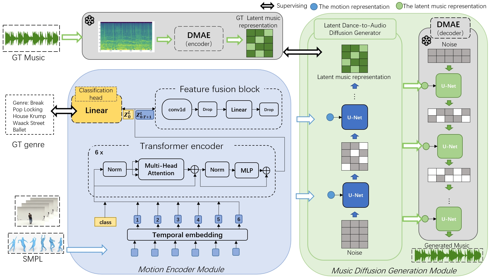

# Dance2Music-Diffusion

Dance2Music-Diffusion: Leveraging Latent Diffusion Models for Music Generation from Dance Videos

</img>

## Overview

Dance2Music-Diffusion is a state-of-the-art model designed to generate music from dance videos using latent diffusion models. This project explores the intersection of dance and music, providing an innovative solution for creating synchronized audio-visual experiences.

## Features

- **Latent Diffusion Model**: Utilizes advanced diffusion techniques to generate music.
- **Dance Video Input**: Processes dance sequences to create matching music.
- **Open Source**: The model and code are available for modification and improvement by the community.

## Paper Abstract

With the rapid development of social networks, short videos have become a popular form of content, especially dance videos. In this context, research on automatically generating music for dance videos shows significant practical value. However, existing studies face challenges such as limited richness in music timbre and lack of synchronization with dance movements. In this paper, we propose Dance2Music-Diffusion, a novel framework for music generation from dance videos using latent diffusion models. Our approach includes a motion encoder module for extracting motion features and a music diffusion generation module for generating latent music representations. By integrating dance type monitoring and latent diffusion techniques, our framework outperforms existing methods in generating complex and rich dance music. We conducted objective and subjective evaluations of the results produced by various existing models on the AIST++ dataset. Our framework shows outstanding performance in terms of beat recall rate, consistency with GT beats, and coordination with dance movements. This work represents the state of the art in automatic music generation from dance videos, is easy to train, and has implications for enhancing entertainment experiences and inspiring innovative dance productions. Sample videos of our generated music and dance can be viewed at [https://youtu.be/eCvLdLdkX-Y](https://youtu.be/eCvLdLdkX-Y).

## Installation

To get started with Dance2Music-Diffusion, follow these steps:

1. Clone the repository:
    ```sh
    git clone https://github.com/yourusername/Dance2Music-Diffusion.git
    cd Dance2Music-Diffusion
    ```

2. Create and activate a virtual environment:
    ```sh
    python3 -m venv venv
    source venv/bin/activate
    ```

3. Install the required dependencies:
    ```sh
    pip install -r requirements.txt
    ```

## Usage

###  Data for training

Download the dataset zip file d2m-diffusion necessary package.zip and extract all files to edge_aistpp/. This folder contains the raw files of the AIST++ dataset, the latent music representations encoded by DMAE, and the DMAE model files.

edge_aistpp/
├── DMAE1d-ATC32-v3/
├── genre_token/
├── smpl_motion_219/
├── wavs/
├── wavs_latent/
└── extract_wav_latent.py

Baidu Cloud link: https://pan.baidu.com/s/14PO1xosgtVrmGzGmeyPBMA?pwd=0413
Extraction code: 0413

### Training the Model

To train the model, run the following command:
```sh
python train_con_116_latent_unet_MOT_origendata_219prompt.py
```

### Generating Music

To generate music from a dance video, use the following command:
```sh
python genrate_116_latent_unet_MOT_origendata.py
```

### Extracting Music Latent Representations

To extract music latent representations from the original dataset, run:
```sh
python extract_wav_latent.py 
```


## Directory Structure

- `a__unet/`: Contains U-Net model implementation.
- `aist_plusplus/`: Dataset related files.
- `audio_diffusion_pytorch/`: Audio diffusion model implementation.
- `d2m/`: Main directory for Dance2Music code.
- `evaluate/`: Evaluation scripts.
- `src/`: Source code files.
- `extract_wav_latent.py`: Script to extract music latent representations.
- `genrate_latent_unet_MOT_origendata.py`: Script for music generation.
- `requirements.txt`: List of dependencies.
- `setup.py`: Setup script for the project.
- `train_con_latent_unet_MOT_origendata_219prompt.py`: Script to train the model.

## Appreciation

Special thanks to the following for their support and contributions:

* [audio-diffusion-pytorch](https://github.com/archinetai/audio-diffusion-pytorch) for DMAE and U_Net.

* [Aist++](https://google.github.io/aistplusplus_dataset/factsfigures.html) for dance video dataset.


The pre-trained model and the dataset used for training will be released soon. Stay tuned for updates!

## Citations

DDPM Diffusion
```bibtex
@misc{2006.11239,
Author = {Jonathan Ho and Ajay Jain and Pieter Abbeel},
Title = {Denoising Diffusion Probabilistic Models},
Year = {2020},
Eprint = {arXiv:2006.11239},
}
```

DDIM (V-Sampler)
```bibtex
@misc{2010.02502,
Author = {Jiaming Song and Chenlin Meng and Stefano Ermon},
Title = {Denoising Diffusion Implicit Models},
Year = {2020},
Eprint = {arXiv:2010.02502},
}
```

V-Diffusion
```bibtex
@misc{2202.00512,
Author = {Tim Salimans and Jonathan Ho},
Title = {Progressive Distillation for Fast Sampling of Diffusion Models},
Year = {2022},
Eprint = {arXiv:2202.00512},
}
```

Imagen (T5 Text Conditioning)
```bibtex
@misc{2205.11487,
Author = {Chitwan Saharia and William Chan and Saurabh Saxena and Lala Li and Jay Whang and Emily Denton and Seyed Kamyar Seyed Ghasemipour and Burcu Karagol Ayan and S. Sara Mahdavi and Rapha Gontijo Lopes and Tim Salimans and Jonathan Ho and David J Fleet and Mohammad Norouzi},
Title = {Photorealistic Text-to-Image Diffusion Models with Deep Language Understanding},
Year = {2022},
Eprint = {arXiv:2205.11487},
}
```

audio-diffusion-pytorch
```bibtex
@article{schneider2023mo,
  title={Mo$\backslash$\^{} usai: Text-to-music generation with long-context latent diffusion},
  author={Schneider, Flavio and Kamal, Ojasv and Jin, Zhijing and Sch{\"o}lkopf, Bernhard},
  journal={arXiv preprint arXiv:2301.11757},
  year={2023}
}
```
